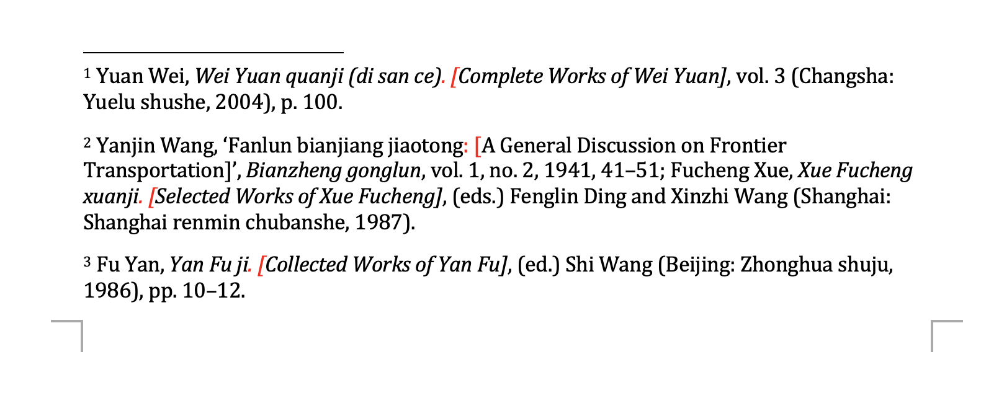

# CSL Style Customization

## Goal

How to remove the punctuation between `title` and `titleaddon/subtitle`? E.g. removing the period `.` or colon `:` between `title` and `titleaddon/subtitle` in the following example:



## Command

### Convert BibLaTeX to CSL JSON:

```shell
pandoc -f biblatex bib.bib -t csljson -o bib.json
```

### Generate DOCX:

```shell
pandoc -C test.md -o test.docx
```

## Discussion

[jgm/pandoc#9725](https://github.com/jgm/pandoc/discussions/9725)
